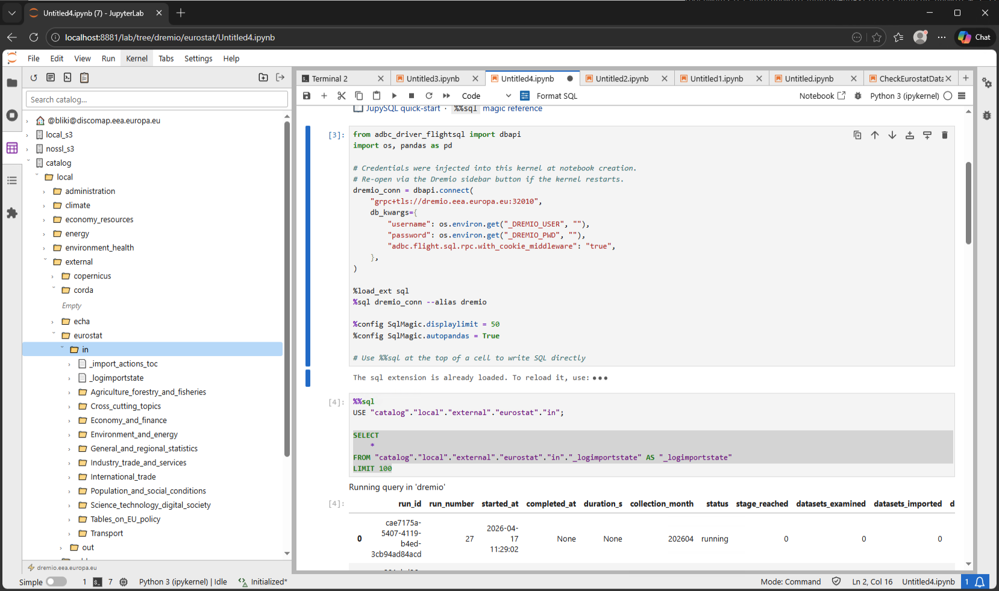

# jupyter-dremio

A JupyterLab 4.x sidebar extension for browsing and querying the Dremio catalog.



## Features

### Catalog browser
- Browse spaces, sources, folders, tables, and views in a collapsible sidebar tree
- Expand any table or view to see its **column definitions** with data-type badges
- Different icons for physical tables vs virtual views

### Search
- **Full-text catalog search** — type in the search box above the tree (or press Enter for instant results)
- Results appear as a collapsible **Search Results** node at the top of the tree; the existing tree stays open
- Only datasets (tables and views) are returned — uses the Dremio `POST /api/v3/search` API

### Drag & drop
- Drag any table or view into a notebook cell to insert a formatted multi-line `SELECT` statement with actual column names

### Context menu (right-click)
- **Open wiki** — renders the Dremio wiki for that item as Markdown in a main-area tab
- **Copy path to clipboard** — copies the full SQL-quoted path
- **Create folder** — creates a sub-folder inside the selected space or folder
- **Delete table / view / folder** — with confirmation dialog
- **Register as Parquet table** — promotes a raw FILE item (e.g. an S3 Parquet file) to a physical dataset

### Notebooks
- **New Notebook** button — opens a Python 3 notebook pre-wired with an ADBC/JupySQL connection to Dremio, including a `%%sql` cell ready to run
- **Secure by design** — username and password are injected silently into the running kernel and never stored in the `.ipynb` file, so notebooks are safe to share or commit to version control
- If a catalog item is selected, the `%%sql` cell is pre-filled with a `USE "space"."folder";` statement so queries run in the right context immediately

### Jobs viewer
- **Jobs** button — opens a main-area tab showing recent Dremio job history with status badges, duration, SQL preview, and column selector

### Authentication
- Username + password (proxy mode and direct mode)
- SSO / Kerberos (proxy mode only — requires `requests-kerberos` on the Jupyter server)
- Login form remembers the Dremio URL and username between sessions (password is never stored)

## Install

Download `jupyter_dremio-0.1.15-py3-none-any.whl` from the [latest release](https://github.com/blikij/jupyter-dremio/releases/latest), then run:

```bash
pip install jupyter_dremio-0.1.15-py3-none-any.whl
```

Restart JupyterLab after installation. The Dremio icon appears in the left sidebar.

See [INSTALL.md](INSTALL.md) for full installation and verification instructions.

## Requirements

- JupyterLab 4.x
- Python 3.8+
- `requests` ≥ 2.28

Optional:
- `requests-kerberos` — for SSO/Kerberos login
- `adbc-driver-flightsql` + `jupysql` — used by the generated notebooks for running SQL
- `sqlglot[rs]` — faster SQL parsing used by JupySQL (`pip install sqlglot[rs]`)

## Changelog

### 0.1.15
- **Secure notebooks** — username and password are never written into the `.ipynb` file.
  They are injected silently into the kernel's environment at notebook creation time
  (`os.environ["_DREMIO_USER"]` / `os.environ["_DREMIO_PWD"]`), so notebooks can be
  freely shared or committed to version control without exposing credentials.
- **USE context** — if a folder or table is selected in the catalog tree when clicking
  New Notebook, the `%%sql` cell is pre-filled with `USE "space"."folder";` so queries
  run in the right context without typing the full path.
- **Quoted SQL aliases** — drag-and-drop now generates `AS "Table Name"` (double-quoted)
  so names with spaces, reserved words, or special characters work in all cases.

### 0.1.13
- Full-text catalog search via Dremio `POST /api/v3/search` (TABLE and VIEW only)
- Search results appear as a virtual node inside the existing tree (tree never resets)
- Press Enter for immediate search or wait 400 ms after typing
- Search result items use `/api/v3/catalog/by-path/` for reliable column lookup
- Right-click FILE items to register them as Parquet physical datasets
- Errors and diagnostics shown inline inside the Search Results node

### 0.1.11
- Multi-line drag-and-drop SQL with actual column names
- Markdown intro cell in generated notebooks
- Delete table/view context menu (checks all Dremio API response variations)
- Improved SSO error messages distinguishing Kerberos vs LDAP deployments
- Jobs viewer 404/500 fixes (v3 → apiv2 fallback)
- Login form persists Dremio URL and username in localStorage
- Column definitions with type badges when expanding a table or view
- Table and view icons (SVG) distinct from each other
